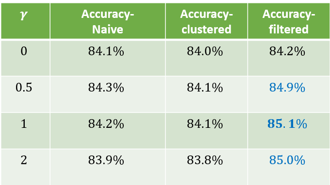

# Focal Loss With Contrastive Learning

The application of contrastive learning to self-supervised representation learning has seen an
upsurge in recent years, leading to state-of-the-art performance in unsupervised training of deep
image models. Focal loss is a loss function that reduces the relative loss for well-classified examples
putting more focus on difficult, misclassified examples. In this project, we examine the impact of
focal loss on the self-supervised contrastive approach.

For a detailed explanation of our project please read Focal_loss_for_contrastive_learning.pdf.

### Requirements
1. python 3.7
2. For the rest of the required python packages look at the requirement.txt file.

## Train Moco

To reproduce the trained model in our project run:

> python moco_train.py

If you want to modify the training hyperparameters you can edit the 
dictionary _HYPER_PARAMS in the file (there is documentation inside the file regarding the parameters). 

## Train Linear Classifier

To train the linear classifier on the embeddings from the unsupervised trained backbone run:

> python linear_clf_train.py moco_name

The argument "moco_name" is the name of the directory containing a trained backbone from moco_train.py in the 
results directory. For example:
> python linear_clf_train.py moco_pretrained_2021_10_01_14_01

## Results

The results presented here are for different backbones trained differently (with/without filtering clustering and 
with/without focal loss). In the following table you can see the accuracies of the linear classifier trained on the 
embeddings of these different backbones:

We can see an improvement in performance for backbones that were trained with filtering and focal loss.
For additional results you should look at Focal_loss_for_contrastive_learning.pdf.